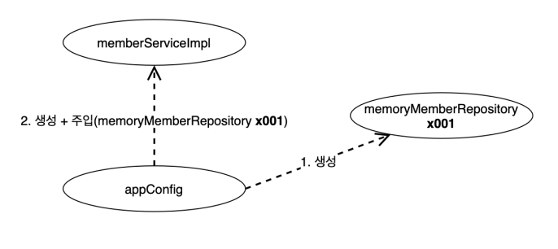

## 기존 코드 객체지향 원리 적용

## 새로운 할인 정책 개발
- 새로운 할인 정책을 확장해보기!
- 악덕 기획자: 서비스 오픈 직전에 할인 정책을 지금처럼 고정 금액 할인이 아니라 좀 더 합리적인 주문 금액당 할
- 인하는 정률% 할인으로 변경하고 싶어요. 예를 들어서 기존 정책은 VIP가 10000원을 주문하든 20000원을 주문하든 항상 1000원을 할인했는데, 이번에 새로 나온 정책은 10%로 지정해두면 고객이 10000원 주문시 1000원을 할인해주고, 20000원 주문시에 2000원을 할인해주는 거에요!

#### 에자일? 유연한 설계 필요한 이유?
- 순진 개발자: 제가 처음부터 고정 금액 할인은 아니라고 했잖아요.
- 악덕 기획자: `애자일 소프트웨어 개발 선언 몰라요?` “계획을 따르기보다 변화에 대응하기를”
- 순진 개발자: … (하지만 난 유연한 설계가 가능하도록 객체지향 설계 원칙을 준수했지 후후)

[애자일 소프트웨어 개발 선언](https://agilemanifesto.org/iso/ko/manifesto.html)

- 계획보다는 변화에 대응하기


## 관심사의 분리
- 애플리케이션을 하나의 공연이라 생각해보자. 각각의 인터페이스를 배역(배우 역할)이라 생각하자. 그런데! 실제 배역 맞는 배우를 선택하는 것은 누가 하는가?
- 로미오와 줄리엣 공연을 하면 로미오 역할을 누가 할지 줄리엣 역할을 누가 할지는 배우들이 정하는게 아니다. 이전 코드는 마치 로미오 역할(인터페이스)을 하는 레오나르도 디카프리오(구현체, 배우)가 줄리엣 역할(인터페이스)을 하는 여자 주인공(구현체, 배우)을 직접 초빙하는 것과 같다. 
    - 디카프리오는 공연도 해야하고 동시에 여자 주인공도 공연에 직접 초빙해야 하는 다양한 책임을 가지고 있다

### 관심사 분리가 필요함.
- 관심사를 분리하자!
- 배우는 본인의 역할인 배역을 수행하는 것에만 집중해야 한다.
- 디카프리오는 어떤 여자 주인공이 선택되더라도 똑같이 공연을 할 수 있어야 한다.
- 공연을 구성하고, 담당 배우를 섭외하고, 역할에 맞는 배우를 지정하는 책임을 담당하는 별도의 `공연 기획자가 나올시점`이다.
- 공연 기획자를 만들고, 배우와 공연 기획자의 책임을 확실히 분리하자.


## AppConfig 등장
- 생성자 주입을 할것임!!
- 애플리케이션의 전체 동작 방식을 구성(config)하기 위해, 구현 객체를 생성하고, 연결하는 책임을 가지는 별도의 설정 클래스를 만들자!!

- AppConfig는 애플리케이션의 실제 동작에 필요한 구현 객체를 생성한다.
    - MemberServiceImpl
    - MemoryMemberRepository
    - OrderServiceImpl
    - FixDiscountPolicy
- AppConfig는 생성한 객체 인스턴스의 참조(레퍼런스)를 생성자를 통해서 주입(연결)해준다.
    - MemberServiceImpl MemoryMemberRepository
    - OrderServiceImpl MemoryMemberRepository , FixDiscountPolicy
- 참고: 지금은 각 클래스에 생성자가 없어서 컴파일 오류가 발생한다. 바로 다음에 코드에서 생성자를 만든다.


### 설계 변경으로 MemberServiceImpl 은 더이상 MemoryMemberRepository 를 의존하지 않는다!
- 단지 MemberRepository 인터페이스만 의존한다.
- MemberServiceImpl 입장에서 생성자를 통해 어떤 구현 객체가 들어올지(주입될지)는 알 수 없다.
- MemberServiceImpl 의 생성자를 통해서 어떤 구현 객체를 주입할지는 오직 외부( AppConfig )에서 결정된다.
- MemberServiceImpl 은 이제부터 의존관계에 대한 고민은 외부에 맡기고 `실행에만 집중하면 된다.`


'

- `객체의 생성과 연결은 AppConfig 가 담당`한다.
- `DIP 완성`: `MemberServiceImpl` 은 `MemberRepository` 인 추상에만 의존하면 된다. 이제 구체 클래스를 몰라도 된다.
- `관심사의 분리`: 객체를 생성하고 연결하는 역할과 실행하는 역할이 명확히 분리되었다



```java
    public MemberService memberService(){
       return new MemberServiceImpl(new MemoryMemberRepository()); // 생성자에 MemoryMemberRepository 같이 전달함
    }

```
### 의존관계 주입
- appConfig 객체는 memoryMemberRepository 객체를 생성하고 그 참조값을 memberServiceImpl 을 생성하면서 생성자로 전달한다.
- 클라이언트인 memberServiceImpl 입장에서 보면 의존관계를 마치 외부에서 주입해주는 것 같다고 해서 DI(Dependency Injection) 우리말로 `의존관계 주입` 또는 `의존성 주입`이라 한다.


## 정리
- AppConfig를 통해서 관심사를 확실하게 분리했다.
- 배역, 배우를 생각해보자.
- AppConfig는 공연 기획자다. 
- AppConfig는 구체 클래스를 선택한다. 배역에 맞는 담당 배우를 선택한다. 애플리케이션이 어떻게 동작해야 할지 전체 구성을 책임진다.
- 이제 각 배우들은 담당 기능을 실행하는 책임만 지면 된다.
- `OrderServiceImpl`은 `기능을 실행하는 책임`만 지면 된다.