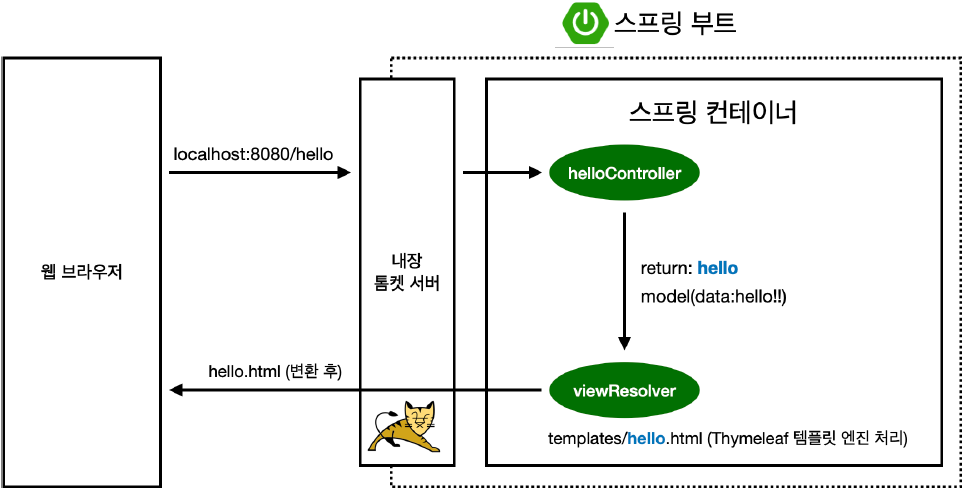
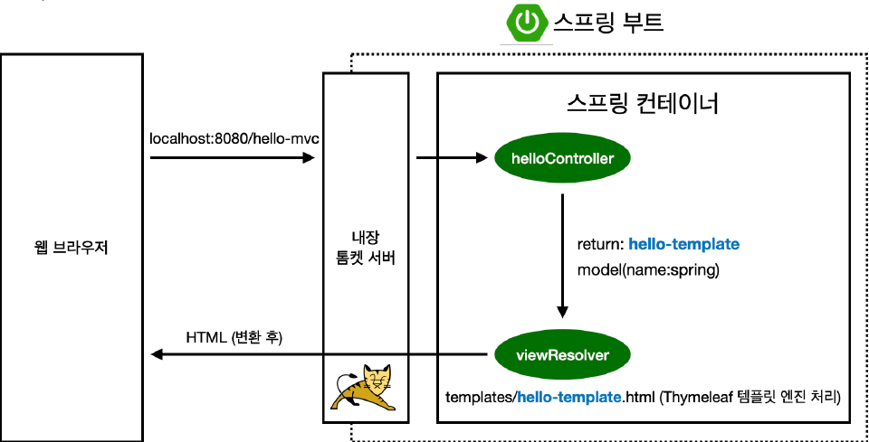
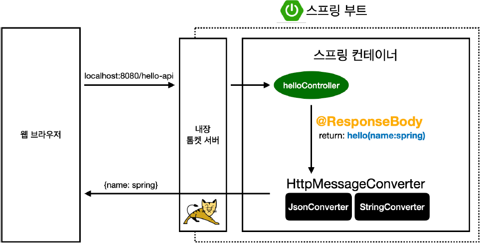

# 1. 프로젝트 환경 설정
## 프로젝트 생성
**스프링 부트 스타터 사이트로 이동해서 스프링 프로젝트 생성**
- https://start.spring.io
    - Project: Gradle - Groovy
    - Language: Java
    - Packaging: Jar
    - Dependencies: Spring Web, Thymeleaf

### 라이브러리 살펴보기
> Gradle은 의존관계가 있는 라이브러리를 함께 다운로드 한다.

**스프링 부트 라이브러리**
- spring-boot-starter-web
    - spring-boot-starter-tomcat: 톰캣 (웹서버)
    - spring-webmvc: 스프링 웹 MVC
- spring-boot-starter-thymeleaf: 타임리프 템플릿 엔진(View)
- spring-boot-starter(공통): 스프링 부트 + 스프링 코어 + 로깅
    - spring-boot
        - spring-core
    - spring-boot-starter-logging
        - logback, slf4j(인터페이스)

**테스트 라이브러리**
- spring-boot-starter-test
    - junit: 테스트 프레임워크
    - mockito: 목 라이브러리
    - assertj: 테스트 코드를 좀 더 편하게 작성하게 도와주는 라이브러리
    - spring-test: 스프링 통합 테스트 지원

## View 환경설정
### Welcome Page 만들기
`resources/static/index.html`
```html
<!DOCTYPE HTML>
<html>
<head>
    <title>Hello</title>
    <meta http-equiv="Content-Type" content="text/html; charset=UTF-8" />
</head>
<body>
Hello
<a href="/hello">hello</a>
</body>
</html>
```
- 스프링 부트가 제공하는 Welcome Page 기능
    - `static/index.html` 을 올려두면 Welcome page 기능을 제공한다.

### thymeleaf 템플릿 엔진
- thymeleaf 공식 사이트: https://www.thymeleaf.org/
- 스프링 공식 튜토리얼: https://spring.io/guides/gs/serving-web-content/
- 스프링부트 메뉴얼: https://docs.spring.io/spring-boot/docs/2.3.1.RELEASE/reference/html/spring-boot-featureshtml#boot-features-spring-mvc-template-engines

```java
package hello.hello_spring.controller;

import org.springframework.stereotype.Controller;
import org.springframework.ui.Model;
import org.springframework.web.bind.annotation.GetMapping;

@Controller
public class HelloController {
    @GetMapping("hello")    // url: hello
    public String hello(Model model) {
        model.addAttribute("data", "hello!!");  // model에 key, value 값으로 "data", "hello!!" 넣어준다.
        return "hello"; // hello.html 렌더링
    }
}
```
`resources/templates/hello.html`
```html
<!DOCTYPE HTML>
<html xmlns:th="http://www.thymeleaf.org">
<head>
    <title>Hello</title>
    <meta http-equiv="Content-Type" content="text/html; charset=UTF-8" />
</head>
<body>
<p th:text="'안녕하세요. ' + ${data}" >안녕하세요. 손님</p>
</body>
</html>
```

**thymeleaf 템플릿엔진 동작 확인**
- 실행: http://localhost:8080/hello

**동작 환경 그림**

- 컨트롤러에서 리턴 값으로 문자를 반환하면 뷰 리졸버( `viewResolver` )가 화면을 찾아서 처리한다.
    - 스프링 부트 템플릿엔진 기본 viewName 매핑
    - `resources:templates/` +{ViewName}+ `.html`

> 참고: `spring-boot-devtools` 라이브러리를 추가하면, `html` 파일을 컴파일만 해주면 서버 재시작
없이 View 파일 변경이 가능하다.\
> 인텔리J 컴파일 방법: 메뉴 build → Recompile

## 빌드하고 실행하기
- Git bash로 이동
    1. `/gradlew build`
    2. `cd build/libs`
    3. `java -jar hello-spring-0.0.1-SNAPSHOT.jar`
    4. 실행 확인

# 2. 스프링 웹 개발 기초
## 정적 컨텐츠
- 스프링 부트 정적 컨텐츠 기능
- https://docs.spring.io/spring-boot/docs/2.3.1.RELEASE/reference/html/spring-bootfeatures.html#boot-features-spring-mvc-static-content

`resources/static/hello-static.html`
```html
<!DOCTYPE HTML>
<html>
<head>
    <title>static content</title>
    <meta http-equiv="Content-Type" content="text/html; charset=UTF-8" />
</head>
<body>
정적 컨텐츠 입니다.
</body>
</html>
```
**실행**
- http://localhost:8080/hello-static.html

**정적 컨텐츠 이미지**


## MVC와 템플릿 엔진
- MVC: Model, View, Controller

### Controller
```java
@Controller
public class HelloController {
    @GetMapping("hello-mvc")
    public String helloMvc(@RequestParam("name") String name, Model model) {
        model.addAttribute("name", name);
        return "hello-template";
    }
}
```

### View
`resources/templates/hello-template.html`
```html
<html xmlns:th="http://www.thymeleaf.org">
<body>
    <p th:text="'hello ' + ${name}">hello! empty</p>
</body>
</html>
```
**실행**
- http://localhost:8080/hello-mvc?name=spring

**MVC, 템플릿 엔진 이미지**

## API

### @ResponseBody 문자 반환
```java
@Controller
public class HelloController {
    @GetMapping("hello-string")
    @ResponseBody
    public String helloString(@RequestParam("name") String name) {
        return "hello " + name;
    }
}
```
- `@ResponseBody` 를 사용하면 뷰 리졸버( `viewResolver` )를 사용하지 않음
- 대신에 HTTP의 BODY에 문자 내용을 직접 반환(HTML BODY TAG를 말하는 것이 아님)

**실행**
- http://localhost:8080/hello-string?name=spring

### @ResponseBody 객체 반환
```java
@Controller
public class HelloController {

    @GetMapping("hello-api")
    @ResponseBody
    public Hello helloApi(@RequestParam("name") String name) {
        Hello hello = new Hello();
        hello.setName(name);
        return hello;
    }
    static class Hello {
        private String name;

        public String getName() {
            return name;
        }

        public void setName(String name) {
            this.name = name;
        }
    }
}
```
- `@ResponseBody` 데코레이터 사용
- 객체를 반환하면 객체가 JSON으로 변환됨

**실행**
- http://localhost:8080/hello-api?name=spring

**@ResponseBody 사용 원리**

- `@ResponseBody` 를 사용
    - HTTP의 BODY에 문자 내용을 직접 반환
    - `viewResolver` 대신에 `HttpMessageConverter` 가 동작
    - 기본 문자처리: `StringHttpMessageConverter`
    - 기본 객체처리: `MappingJackson2HttpMessageConverter`
    - byte 처리 등등 기타 여러 HttpMessageConverter가 기본으로 등록되어 있음
