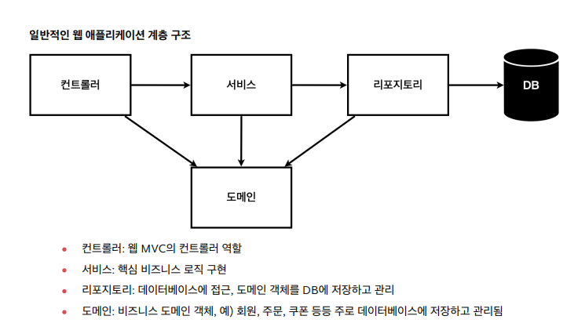

## 


### AfterEach 어노테이션
```java
    @AfterEach // 각 메서드 실행이 끝날때마다 실행되게 하는 어노테이션
    public void afterEach(){
        repository.clearStore(); // 레포지토리를 싹 지워주는 것임.
    }
```


## 테스트 케이스 작성법
- given / when / then으로 일반적으로 작성된다.

- 예시
```java

    // 테스트명은 과감하게 한국어로 적어도 됨.
    // 테스트는 정상 테스트도 중요하지만 예외테스트가 더 중요함.
    @Test
    void 회원가입() {
        //given
        Member member = new Member();
        member.setName("hello");

        //when
        Long saveId = memberService.join(member);

        //then
        Member findMember = memberService.findOne(saveId).get();
        assertThat(member.getName()).isEqualTo(findMember.getName());
        
    }
```

### `@BeforeEach` 어노테이션 
- 각 테스트 실행 전에 호출된다. 테스트가 서로 영향이 없도록 항상 새로운 객체를 생성하고, 의존관계도 새로 맺어준다.


## 스프링 빈을 등록하는 2가지 방법
1. 컴포넌트 스캔과 자동 의존관계 설정
2. 자바 코드로 직접 스프링 빈 등록하기


## 1. 컴포넌트 스캔과 자동 의존관계 설정(어노테이션 활용)

### 컴포넌트 스캔 원리
- @Component 애노테이션이 있으면 스프링 빈으로 자동 등록된다.
- @Controller 컨트롤러가 스프링 빈으로 자동 등록된 이유도 컴포넌트 스캔 때문이다.
- @Component 를 포함하는 다음 애노테이션도 스프링 빈으로 자동 등록된다.
    - @Controller (안으로 들어가면 component가 있음.)
    - @Service (안으로 들어가면 component가 있음.)
    - @Repository (안으로 들어가면 component가 있음.)


## 
- memberService 와 memberRepository 가 스프링 컨테이너에 스프링 빈으로 등록되었다.

### 참고: 스프링은 스프링 컨테이너에 스프링 빈을 등록할 때, 기본으로 싱글톤으로 등록한다
    - (유일하게 하나만등록해서 공유한다) 따라서 같은 스프링 빈이면 모두 같은 인스턴스다. 설정으로 싱글톤이 아니게 설정할 수 있지만, 특별한 경우를 제외하면 대부분 싱글톤을 사용한다.


## 2. 자바 코드로 직접 스프링 빈 등록하기
- config 클래스 하나 만들어서 Bean 등록해주면 됨.
```java
@Configuration
public class SpringConfig {

    @Bean
    public MemberService memberService(){
        return new MemberService(memberRepository());
    }

    @Bean
    public MemberRepository memberRepository(){
        return new MemoryMemberRepsotiroy();
    }


}
```


## 참고사항 (Point)
- 참고: XML로 설정하는 방식도 있지만 최근에는 잘 사용하지 않으므로 생략한다.

- 참고: DI에는 필드 주입, setter 주입, 생성자 주입 이렇게 3가지 방법이 있다. 의존관계가 실행중에 동적으로 변하는 경우는 거의 없으므로 생성자 주입을 권장한다.

- 참고: 실무에서는 주로 정형화된 컨트롤러, 서비스, 리포지토리 같은 코드는 컴포넌트 스캔을 사용한다. 그리고 정형화 되지 않거나, 상황에 따라 구현 클래스를 변경해야 하면 설정을 통해 스프링 빈으로 등록한다.

- 주의: @Autowired 를 통한 DI는 helloController , memberService 등과 같이 스프링이 관리하는 객체에서만 동작한다. 스프링 빈으로 등록하지 않고 내가 직접 생성한 객체에서는 동작하지 않는다.

- 스프링 컨테이너, DI 관련된 자세한 내용은 스프링 핵심 원리 강의에서 설명한다